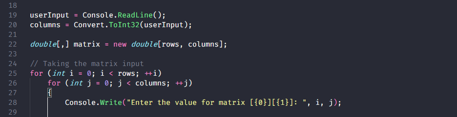

# CSharp Practice Programs

Here almost every CSharp 🐱‍🏍 files are of my Practice files. I learn all these from different Website, Apps, Online learning courses and from my Teacher.

&emsp;
&emsp;
&emsp;[](https://github.com/Koushikon/CS.Programs)

I'm 🎃 Working on Few `C#` with `.Net 5`, `.Net 6`, `.Net 7` versions.



---

### File `global.json` for .Net:
`global.json`: Used for Set Root SDK Version with this file in Sub-Directory we cannnot Run Apps with Other SDK version. `global.json` Contain:
```JSON
{
  "sdk": {
    "version": "5.0.402", // "6.0.100" or "7.0.200"
  }
}
```